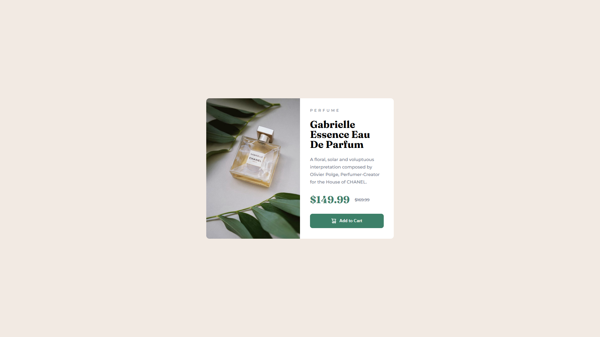

# Frontend Mentor - Product preview card component solution

This is a solution to the [Product preview card component challenge on Frontend Mentor](https://www.frontendmentor.io/challenges/product-preview-card-component-GO7UmttRfa).

## Table of contents

- [Overview](#overview)
  - [The challenge](#the-challenge)
  - [Screenshot](#screenshot)
  - [Links](#links)
- [My process](#my-process)
  - [Built with](#built-with)
  - [What I learned](#what-i-learned)
  - [Useful resources](#useful-resources)
- [Author](#author)

## Overview

### The challenge

Users should be able to:

- View the optimal layout depending on their device's screen size
- See hover and focus states for interactive elements

### Screenshot



### Links

- Solution URL: [GitHub](https://github.com/g-akca/product-preview-card)
- Live Site URL: [Product Preview Card](https://g-akca.github.io/product-preview-card/)

## My process

### Built with

- Semantic HTML5 markup
- CSS custom properties
- Flexbox
- CSS Grid
- Mobile-first workflow
- Media queries

### What I learned

I was able to change the arrangement of the items inside the card component and align the card at the center of the screen by writing the CSS code below. It helped me reach the responsive design on desktop the challenge asked for, and keep a mobile-first workflow.

```css
@media screen and (min-width: 768px) {
    body {
        align-items: center;
        padding: 0 14px;
        height: 100vh;
    }

    #card-container {
        max-width: 600px;
        display: grid;
        grid-template-columns: 1fr 1fr;
    }

    #card-container > img {
        content:url("./images/image-product-desktop.jpg");
    }
    ...
}
```

### Useful resources

- [Is it possible to set a src attribute of an img tag in CSS? - Stack Overflow](https://stackoverflow.com/questions/2182716/is-it-possible-to-set-a-src-attribute-of-an-img-tag-in-css) - The answers below this question helped me change the source url of the perfume image on larger screen sizes.

## Author

- GitHub - [@g-akca](https://github.com/g-akca)
- Frontend Mentor - [@g-akca](https://www.frontendmentor.io/profile/g-akca)
